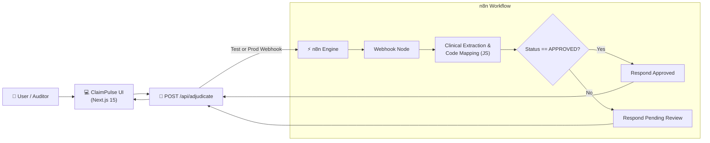

# 🛡️ ClaimPulse AI — Autonomous Health Claim Adjudication Engine

[](https://nextjs.org/)
[](https://www.typescriptlang.org/)
[](https://n8n.io/)
[](https://tailwindcss.com/)

**ClaimPulse AI** is an intelligent, automated health insurance claim adjudication system. It bridges a modern Next.js 15 web interface with an **n8n workflow automation engine** to perform instant clinical code cross-validation, policy sub-limit compliance checking, and financial deduction ledger generation.

---

## 🌟 Key Features

* **⚡ Real-Time n8n Workflow Integration**: Connects via secure webhooks to n8n for real-time adjudication pipeline processing.
* **🩺 Clinical Coding Consistency Engine**: Validates ICD-10 diagnosis codes against CPT procedure codes (e.g., detecting mismatches between Appendicitis `K35.80` and Outpatient visit `99213`).
* **💰 Policy Sub-Limit Compliance**: Automatically applies policy rules (e.g., 1% Sum Insured cap on daily room rent) and calculates itemized deductions.
* **👤 Human-in-the-Loop Supervisor Override**: Allows senior medical auditors to review flagged claims and sign off with custom audit notes.
* **🧪 1-Click Test Scenarios**: Includes pre-built test cases (Clean Appendectomy, Coding Mismatch Escalate, Sub-limit Cap Breach).
* **📄 Printable Settlement Summary Memos**: One-click print export for claim settlement audits.

---

## 🏗️ Architecture & Data Flow



---

## 📁 Repository Structure

```
claimpulse-ui/
├── app/
│   ├── api/
│   │   └── adjudicate/
│   │       └── route.ts          # API Bridge connecting UI to n8n Webhook
│   ├── globals.css               # Modern dark-mode styling with Tailwind
│   ├── layout.tsx                # Application root layout
│   └── page.tsx                  # Interactive Claim Adjudication Dashboard
├── lib/
│   └── utils.ts                  # Utility functions
├── public/                       # Static assets
├── package.json                  # Project dependencies
└── README.md                     # Documentation
```

---

## 🚀 Getting Started

### Prerequisites

* **Node.js**: v18.17.0 or higher
* **npm**: v9 or higher
* **n8n Instance**: Running locally (`http://localhost:5678`) or self-hosted

### 1. Clone the Repository

```bash
git clone https://github.com/Jeswin-Madona/ClaimPlus-AI.git
cd ClaimPlus-AI/claimpulse-ui
```

### 2. Install Dependencies

```bash
npm install
```

### 3. Configure n8n Workflow

1. Open your n8n dashboard (`http://localhost:5678`).
2. Import the `ClaimPulse AI - Adjudication Engine` workflow.
3. Activate the workflow (`active: true`).
4. Ensure the webhook path is set to `claim-upload`.

### 4. Launch the Application

```bash
npm run dev
```

Open [http://localhost:3000](http://localhost:3000) in your browser to view the ClaimPulse AI dashboard.

---

## 🔌 API Reference

### `POST /api/adjudicate`

Sends a claim payload to the n8n adjudication engine.

#### Request Body
```json
{
  "patient_id": "PAT-8831",
  "patient_name": "Rahul Sharma",
  "diagnosis_narrative": "Acute Appendicitis with laparoscopic appendectomy",
  "icd10_code": "K35.80",
  "cpt_code": "44970",
  "room_rent_billed": 4000,
  "surgery_fee_billed": 60000,
  "medicine_fee_billed": 8500,
  "sum_insured": 500000
}
```

#### Response Body
```json
{
  "status": "APPROVED",
  "patient_id": "PAT-8831",
  "patient_name": "Rahul Sharma",
  "diagnosis_narrative": "Acute Appendicitis with laparoscopic appendectomy",
  "icd10_code": "K35.80",
  "cpt_code": "44970",
  "confidence_score": 1,
  "discrepancy_flags": [],
  "financial_breakdown": {
    "room_rent_billed": 4000,
    "surgery_fee_billed": 60000,
    "medicine_fee_billed": 8500,
    "sum_insured": 500000,
    "max_allowed_room_rent": 5000,
    "total_billed": 72500,
    "total_deducted": 0,
    "total_approved": 72500,
    "deductions": []
  },
  "adjudication_timestamp": "2026-10-05T08:36:50.599Z",
  "_meta": {
    "usedEndpoint": "http://localhost:5678/webhook/claim-upload",
    "processedAt": "2026-10-05T08:36:50.609Z"
  }
}
```

---

## 📜 License

This project is licensed under the [MIT License](LICENSE).

---

## 👤 Author

**Jeswin Madona**
* GitHub: [@Jeswin-Madona](https://github.com/Jeswin-Madona)
